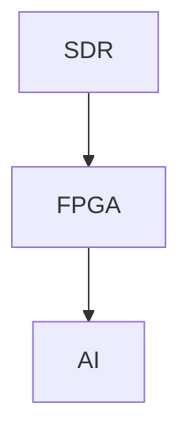

## What is Aperture?

Aperture is an **AI enabled Wi-Fi Imaging System** that can theoretically all fit on one SoC.

We do not physically create an actual SoC, instead we create a prototype design with an SDR, FPGA Board, and Host Device for AI Inference.
We provide some proof of concept that the below pipeline can be turned into an SoC through turning our FPGA design into a GDSII. Since the SDR can also be
manufactured as a GDSII, theoretically the first two blocks (all the hardware) can become a SoC.

Aperture works by incorporating three main systems:

Each of these systems will be discussed in detail on other pages.

